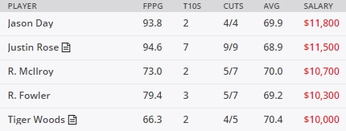
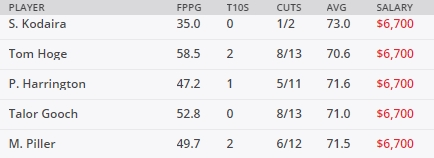
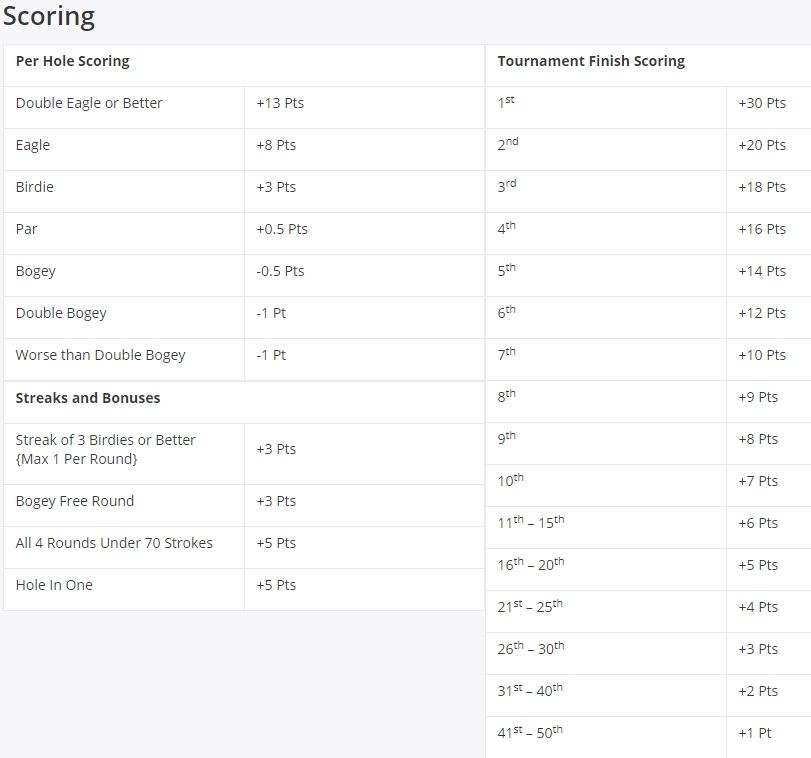
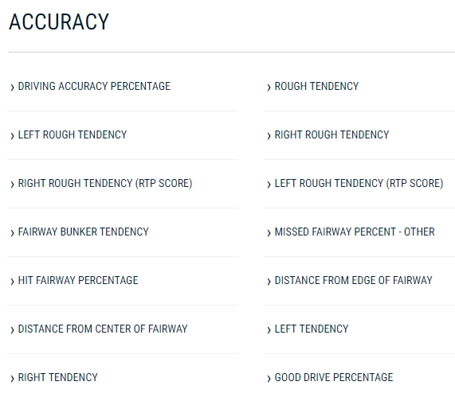
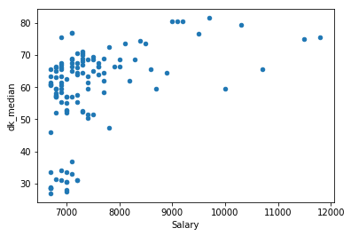
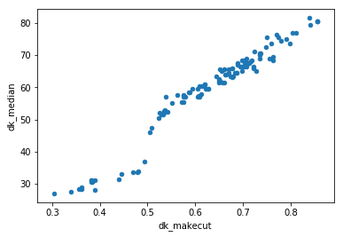
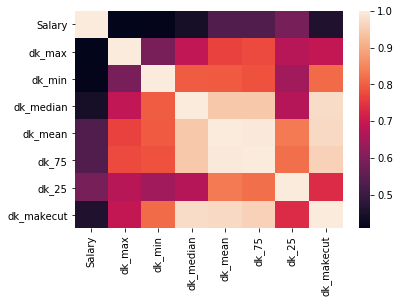
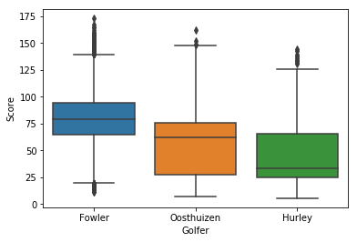
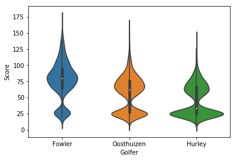

# <center>Daily Fantasy Golf Prediction</center>
*<center>Disclaimer: This content is for educational purposes only. Do not blindly pick a lineup from someone else's algorithm; the sharks will eat your money.</center>*


# Table of contents
1. [Overview](#overview)
    1. [Daily Fantasy Background](#backgound)
    2. [Brainstorming](#brainstorming)
    3. [Our Approach](#approach)
2. [Data](#data)
    1. [Data Collection](#collection)
    2. [Data Formatting](#formatting)
    3. [Data Merging](#merging)
3. [Monte Carlo Simulation](#montecarlo)
    1. [DraftKings Points](#DraftKings)
    2. [Simulation](#simulation)
    3. [Simulation Results](#results)
4. [Linear Programming](#lp)
5. [Afterword](#afterword)


# Overview <a name="overview"></a>
This section has three main components. First, I present preliminary background information explaining the basics of daily fantasy sports. Second, I offer my thoughts regarding the pros/cons to various techniques we can employ in choosing our lineup. Lastly, I outline the approach we will take.

## Daily Fantasy Background <a name="background"></a>
Daily fantasy sports is a marriage between traditional sports gambling and season-long fantasy leagues. For a traditional sports bet, the gambler would place a wager on a specific outcome, i.e., the Los Angeles Lakers will beat the Cleveland Cavaliers by at least 6 points this Saturday. On the other hand, in a season-long fantasy league, players will start the season by drafting a team (filling out the roster with enough athletes in each position), and the athletes earn "points" each week through specific actions. As a simple example, an NFL running back receives 1 point for every 10 yards rushing, 6 points per touchdown, and -2 points per fumble. Throughout the season, players face each other in head-to-head matches and can waive/trade athletes.

Daily fantasy sports perfectly blends these two competition types. Players choose a team for a specific event (or a weekend of competition) and the athletes earn points for various actions. Instead of a draft where each athlete is chosen by at most one player, athletes are assigned a salary value, and each player chooses his team while being constrained to a total salary. While the daily fantasy sports industry is still smaller than the season-long fantasy industry, the numbers still impress. Due to a very aggressive--and overbearing--marketing campaign by DraftKings and FanDuel (which account for roughly 90% of the daily fantasy market), the industry hit peak growth in 2015. While the overall rates of growth have largely stagnated, over [\$3 Billion is spent annually](https://www.bostonglobe.com/business/2017/01/06/daily-fantasy-sports-business-gets-dose-reality/8ShpChIgaD2S8UKguJbdQP/story.html) by players on entry-fees. As such, there are plenty of premium websites offering help, but they often charge exorbitant amounts, such as [\$99/month](https://www.rotoql.com/new-pricing/). However, with some programming and statistical knowledge--and a little bit of elbow grease--we can render these sites irrelevant. 

Let's take a look at a concrete example of how choosing a team works: in DraftKing's daily fantasy golf, each player has \$50,000 salary to spend and must draft 6 golfers. Obviously, the more points an athlete is expected to get, the higher his salary. Here are the highest salaried players for the 2018 Arnold Palmer Invitational:



These salaries are set a few days before the tournament starts. Note that these golfers command a high salary because they are heavily favored to have a great performance. At the other end of the scale we have the lowest priced golfers:



These golfers at the bottom of the barrel make fewer cuts, have way fewer top-10 finishes, and have very low fantasy-points-per-game (FPPG) averages. Since we have a total of \$50,000 to spend across 6 golfers (an average of \$8,333 per golfer) we obviously can't just choose the favorites. The scoring for DraftKings PGA is as follows:



As you can see, there are three different types of scoring. The golfer is assigned a score per hole relative to par. Additionally, there are bonuses for special outcomes, such as a streak of 3 or more birdies, or a bogey free round. Lastly, at the conclusion of the tournament, points are distributed based on the finishing placement. Because of the asymmetry in the scoring, the more volatile player--with the overall score being equal--will finish with more points. For example, a golfer who shoots an Eagle and Bogey gets $8-0.5=7.5$ points, while a golfer who shoots a Birdie and a Par gets $3+0.5=3.5$ points, even though they both scored (-1) overall over those two holes. Another thing to note about PGA events, is that they are 4-days long, and after the second day, they typically cut everyone who is placed beneath 70th. It is virtually impossible to receive a high rate of return if fewer than 5 out of 6 of the golfers in your lineup make the cut.

This has been a grossly oversimplified primer on the world of daily fantasy sports. Before even thinking about playing, I recommend putting in at least a few hours of research to understand the very basics: GPPs vs. Cash games; bankroll management; point-floors; variance; overlay; correlation/stacking; chalk; ownership percentages. My favorite source of information is [RotoGrinders](https://rotogrinders.com/), which has very helpful articles, blogs, tools, and a forum where all players (with a good attitude) are welcome and highly skilled players generously share deep knowledge.

## Brainstorming <a name="brainstorming"></a>
The holy grail of daily fantasy sports is the ability to accurately and consistently project an athlete's score. If the score projections are even remotely accurate, then the meta game of choosing which competitions to enter with which lineups becomes a relatively trivial optimization task. Since deterministically predicting the outcome of a future sporting event is an impossible task, we must treat the score of each athlete as a random variable. In order to see how to best accomplish this, let's dive deeper into the different components of the PGA tour.

The PGA tour is ripe with statistical knowledge. Few sports, outside of baseball, naturally lend themselves to statistics as fluidly as golf does. A decade ago, the PGA partnered with [Shotlink Intelligence](https://www.pgatour.com/stats/shotlinkintelligence/overview.html), and in doing so planted the seeds for the upcoming statistical revolution by providing an extraordinary amount of measurements on every single shot on tour. The PGA tour had its Moneyball moment in 2011 (and a second Renaissance in 2016) with the concept of [Strokes Gained](https://www.pgatour.com/stats/academicdata/shotlink.html), developed by teams at Columbia Business Schools and MIT. The actual formulas are not worth going into here, but the [basic idea](https://www.pgatour.com/news/2016/05/31/strokes-gained-defined.html) is that the various stroked gained metrics reveal how a golfer performs relative to his competition in specific aspects of the game. The PGA has fully embraced the role of statistics and has made a gluttony of stats available on their [official website](https://www.pgatour.com/stats.html)


Each of these tabs contains stats divided into subsections within subsections. For example, one subsection in the "off the tee" tab is the "accuracy" subsection:



The hundreds of different metrics can easily be searchable by year, player, course, etc. There are also many different variables that play into each course, such as length of the course and even the types of greens. One reasonable approach is identify what the key components for a specific course are, and then condition the *shots gained* metrics to those specific features to find a specialist. Josh Culp, a.k.a. futreoffantasy, posts an amazing weekly article on RotoGrinders called [Searching for a Specialist](https://rotogrinders.com/articles/searching-for-a-specialist-arnold-palmer-invitational-2432470). This week, for the Arnold Palmer Invitational, he conditions the shots gained metrics on the following features:
* Bermuda Greens
* Less-than-Driver Courses
* Florida Courses
* Easy-to-Hit Fairways
* Fast Greens

This analysis can be seen as a type of logistic regression, in which he calculates the correlation between each golfer's score and each of these features. He also includes their current form, and posts the resulting stats in a tabular form (here are the first few lines):


In a similar [weekly article](https://rotogrinders.com/articles/pga-first-look-arnold-palmer-invitational-2430429), a legendary daily fantasy player, Derek Farnsworth, a.k.a. Notorious, shares his holistic thoughts along with a helpful objectively designed table. For each golfer, the table contains his salary on DraftKings and FanDuel, his official world golf ranking, Vegas odds to win the tournament, and his performance at the upcoming golf course from previous years. Here are the first few rows of this table:


Vegas odds can be often be helpful to newcomers, since the efficient market theory dictates that the wisdom of the crowd should already incorporate all the relevant variables. However, it is important to remember the major caveat that always comes with Vegas odds: the casinos are not in the business of setting *accurate* odds, rather, they are in the business of making money. Thus, if casinos believe more people will place bets on crowd favorites, such as Tiger Woods and Phil Mickelson, then their odds will be set lower than the *true* odds.

It might seem that this abundance of data would lend itself to deep-learning, or at least simple artificial neural networks. However, I have found that there is not nearly enough data and these methods lead to extreme overfitting, even with finely tuned hyper-parameters. PGA golfers play somewhere in the neighborhood of 25 events a year, which is far short of providing the data required for acceptable performance from any machine learning algorithm. Due to the amount of luck and randomness involved in golf, even simple techniques like regression should only be used to determine the broadest rules of thumb, e.g., Tony Finau is great at long courses.

## Our Approach<a name="approach"></a>
The basic philosophy behind this approach is designed to combat overfitting. We don't take into account any specific features of the course itself besides the number of par-3s, par-4s, and par-5s, and we develop a player profile for each of these three holes based on the probabilities of the different outcomes. I believe the weekly salaries on DraftKings are vastly overfitted to the previous weeks performance; in any given week a great golfer can have a bad outing and an average golfer can have everything go right. For this reason we don't give any special weight to last week's performance, nor the performance at this course from previous years. In order to normalize for the strength of the field, we run a [Monte Carlo simulation](https://en.wikipedia.org/wiki/Monte_Carlo_method) with the golfers in the event, simulating each hole of every round, including the effects of the cut. Here is the outline, with more details provided in their respective sections:
* **Get the data.** We will be scraping data from the PGA's website. The data will simply break down each type of hole (par 3, 4, or 5) into the rates of specific outcomes (double bogey or worse, bogey, par, birdie, eagle) per player. The data will cover the entirety of the previous season, and what has been played of the current season. Pandas will be the main library used for data storage and formatting.
* **Monte Carlo Simulation.** For our simulation, we treat the occurrences of each outcome (besides par) per hole as a Poisson random variable, i.e., the distribution of times in-between specific outcomes are independent and exponentially distributed (memoryless). Each run of the tournament in the simulation assigns all the possible DraftKings points, including the bonuses and finishing points. After the simulation is completed, we establish a profile of various metrics per points per player: max, mean, top quartile, etc. It's crucial that our simulation takes into account the cut halfway through the tournament. We will be using NumPy arrays in our simulation.
* **Linear Programming.** The linear program will be run for each of the separate metrics in order to create a few different lineups depending on the objective function. The only constraints are that we require exactly 6 golfers and that the total salary must be less than or equal to \$50,000. We will use the Python library PuLP as the main tool for the linear programming optimization.

As a proof of concept, I used similar methods in 2017 when I finished 1st (out of 2352 contestants) in a qualifier, earning an entry in the [2017 Fantasy Golf World Championships](https://www.DraftKings.com/lp/2017-golf-world-championship). In the afterword I will discuss the limitations of this approach and possible improvements.


# Data <a name="data"></a>
This section is broken up into data collection, data formatting, and data merging. While data scraping and data munging aren't particularly sexy compared to exotic machine learning algorithms, they are fundamental skills required in order to get real-life data.
## Data Collection <a name="collection"></a>
The first step is to collect the raw data. As mentioned in a previous section, the official PGA website contains a wealth of information. Here, we're just going to get the data for the number of birdies and eagles per type of hole per player. First, we will get the stats from 2017. The core components of the following web scraping code is largely from [this post at Bigish Data](https://bigishdata.com/2016/03/05/gather-all-the-pga-tour-stats/).


```python
import requests
from bs4 import BeautifulSoup
import csv

# A list of url's with the relevant 2017 statistics
url_list = ['https://www.pgatour.com/stats/stat.112.2017.html', #par 3 birdie or better
       'https://www.pgatour.com/stats/stat.447.2017.html', #par 4 eagles
       'https://www.pgatour.com/stats/stat.113.2017.html', #par 4 birdies or better
       'https://www.pgatour.com/stats/stat.448.2017.html', #par 5 eagles
       'https://www.pgatour.com/stats/stat.114.2017.html', #par 5 birdies or better
       'https://www.pgatour.com/stats/stat.02419.2017.html', #bogey average
       'https://www.pgatour.com/stats/stat.02415.2017.html'] #birdie to bogey ratio (to get DB)
#
filenames = ['raw_2017\\par3_bird_2017.csv', 'raw_2017\\par4_eag_2017.csv', 'raw_2017\\par4_bird_2017.csv',
             'raw_2017\\par5_eag_2017.csv', 'raw_2017\\par5_bird_2017.csv', 'raw_2017\\bogey_2017.csv',
             'raw_2017\\doublebogey_2017.csv']


#%% 
for idx, url in enumerate(url_list):
    f = requests.get(url).text #gets the html text
    html = BeautifulSoup(f.replace('\n',''), 'html.parser') #parses the html
    csv_lines = [] #initiate empty csv list
    table = html.find('table', class_='table-styled') #get the headers
    headings = [t.text for t in table.find('thead').find_all('th')]
    csv_lines.append(headings)
    for tr in table.find('tbody').find_all('tr'): #get all the data
        info = [td.text.replace(u'\xa0', u' ').strip() for td in tr.find_all('td')]
        csv_lines.append(info)
    cur_filename = filenames[idx]
    with open(cur_filename, "w") as output: #save the data to file
        writer = csv.writer(output, delimiter=',', lineterminator='\n')
        writer.writerows(csv_lines)
```

Now we do the same for the current stats. Unlike the previous step with the 2017 stats, this step will have to be run each week in order to gather the data from the most recent tournament.


```python
# A list of url's with the relevant 2018 statistics
url_list = ['https://www.pgatour.com/stats/stat.112.html', #par 3 birdie or better
       'https://www.pgatour.com/stats/stat.447.html', #par 4 eagles
       'https://www.pgatour.com/stats/stat.113.html', #par 4 birdies or better
       'https://www.pgatour.com/stats/stat.448.html', #par 5 eagles
       'https://www.pgatour.com/stats/stat.114.html', #par 5 birdies or better
       'https://www.pgatour.com/stats/stat.02419.html', #bogey average
       'https://www.pgatour.com/stats/stat.02415.html'] #birdie to bogey ratio (to get DB)
#
filenames = ['raw_2018\\par3_bird_2018.csv', 'raw_2018\\par4_eag_2018.csv', 'raw_2018\\par4_bird_2018.csv', 
             'raw_2018\\par5_eag_2018.csv', 'raw_2018\\par5_bird_2018.csv', 'raw_2018\\bogey_2018.csv',
             'raw_2018\\doublebogey_2018.csv']


#%% 
for idx, url in enumerate(url_list):
    f = requests.get(url).text #gets the html text
    html = BeautifulSoup(f.replace('\n',''), 'html.parser') #parses the html
    csv_lines = [] #ininiate empty csv list
    table = html.find('table', class_='table-styled') #get the headers
    headings = [t.text for t in table.find('thead').find_all('th')]
    csv_lines.append(headings)
    for tr in table.find('tbody').find_all('tr'): #get all the data
        info = [td.text.replace(u'\xa0', u' ').strip() for td in tr.find_all('td')]
        csv_lines.append(info)
    cur_filename = filenames[idx]
    with open(cur_filename, "w") as output: #save the data to file
        writer = csv.writer(output, delimiter=',', lineterminator='\n')
        writer.writerows(csv_lines)
```

## Data Formatting<a name="formatting"></a>

Now that we have the raw stats, we need to format it to our liking. There are a few tasks we need to accomplish:
* Extract only the columns of relevance and rename the columns to be shorter and more intuitive.
* Join the various formatted dataframes into a single dataframe.
* Calculate the number of eagles per player by subtracting the number of birdies from the "birdies and better" metric.
* Calculate double bogeys similarly.
* Save the final dataframe to file.

As is the case with real data, there are a few cleaning tasks that need to be accomplished. First, any stat that is larger than 999 includes a comma and is read as a string, so it needs to be recast. Second, not all of the players have scored eagles, and those corresponding tables at the PGA site don't include those golfers. We thus need to make sure when we join the dataframes, we do so in an *outer* fashion, and we can then fill in any NaNs with 0's.

The metrics are still in raw numbers; later we will use the *Rounds* column and the individual holes columns to transform each metric to a rate. The names are intuitive: *B*: Bogeys, *DB*: Double Bogey, *P3b*: Par-3 Birdies, *P3e*: Par-3 Eagles, *P3H*: Par-3 Holes, etc.


```python
#%% Reading in and formatting individual stats
import pandas as pd

df_bog = pd.read_csv('raw_2017\\bogey_2017.csv', header=0, index_col='PLAYER NAME', usecols=['PLAYER NAME', 'TOTAL BOGEYS', 'ROUNDS PLAYED'])
df_bog = df_bog.rename(index=str, columns={'TOTAL BOGEYS':'B', 'ROUNDS PLAYED':'Rounds'})

df_db = pd.read_csv('raw_2017\\doublebogey_2017.csv', header=0, index_col='PLAYER NAME', usecols=['PLAYER NAME', 'TOTAL BOGEYS AND WORSE'])
df_db = df_db.rename(index=str, columns={'TOTAL BOGEYS AND WORSE':'DBoW'})

df_bir3 = pd.read_csv('raw_2017\\par3_bird_2017.csv', header=0, index_col='PLAYER NAME', usecols=['PLAYER NAME', 'PAR 3 BIRDIES OR BETTER', 'PAR 3 HOLES'])
df_bir3 = df_bir3.rename(index=str, columns={'PAR 3 BIRDIES OR BETTER':'P3b', 'PAR 3 HOLES':'P3H'})

df_eag4 = pd.read_csv('raw_2017\\par4_eag_2017.csv', header=0, index_col='PLAYER NAME', usecols=['PLAYER NAME', 'TOTAL']) 
df_eag4 = df_eag4.rename(index=str, columns={'TOTAL':'P4e'})

df_bir4 = pd.read_csv('raw_2017\\par4_bird_2017.csv', header=0, index_col='PLAYER NAME', usecols=['PLAYER NAME', 'PAR 4 BIRDIES OR BETTER', 'PAR 4 HOLES'])
if df_bir4['PAR 4 HOLES'].dtype == 'O': #need this if the number includes commas and quotes
    df_bir4['PAR 4 HOLES'] = df_bir4['PAR 4 HOLES'].str.replace(',', '').astype(float)
df_bir4 = df_bir4.rename(index=str, columns={'PAR 4 BIRDIES OR BETTER':'P4be', 'PAR 4 HOLES':'P4H'})

df_eag5 = pd.read_csv('raw_2017\\par5_eag_2017.csv', header=0, index_col='PLAYER NAME', usecols=['PLAYER NAME', 'TOTAL'])
df_eag5 = df_eag5.rename(index=str, columns={'TOTAL': 'P5e'})

df_bir5 = pd.read_csv('raw_2017\\par5_bird_2017.csv', header=0, index_col='PLAYER NAME', usecols=['PLAYER NAME', 'PAR 5 BIRDIES OR BETTER', 'PAR 5 HOLES'])
df_bir5 = df_bir5.rename(index=str, columns={'PAR 5 BIRDIES OR BETTER':'P5be', 'PAR 5 HOLES':'P5H'})

#%% Joining to create overall dataframe
#Now I join them all
df = df_bog.join(df_db).join(df_bir3).join(df_eag4).join(df_bir4).join(df_eag5).join(df_bir5)
df = df.fillna(0) #this is just for eagle

#Now subtract eagles from birdies or better to get just birdies
df['P4b'] = df['P4be'].subtract(df['P4e'])
df = df.drop('P4be', axis=1)

df['P5b'] = df['P5be'].subtract(df['P5e'])
df = df.drop('P5be', axis=1)

#Now subtract bogeys from bogeys or worse to get double bogeys (or worse)
df['DB'] = df['DBoW'].subtract(df['B'])
df = df.drop('DBoW', axis=1)

#%% Saving dataframe
df.to_pickle('raw_2017\\stats_2017.pkl')
```

Let's take a look at the first few and last few rows to get a feel for the dataframe.


```python
df.head()
```


<div>
<style>
    .dataframe thead tr:only-child th {
        text-align: right;
    }

    .dataframe thead th {
        text-align: left;
    }

    .dataframe tbody tr th {
        vertical-align: top;
    }
</style>
<table border="1" class="dataframe">
  <thead>
    <tr style="text-align: right;">
      <th></th>
      <th>B</th>
      <th>Rounds</th>
      <th>P3b</th>
      <th>P3H</th>
      <th>P4e</th>
      <th>P4H</th>
      <th>P5e</th>
      <th>P5H</th>
      <th>P4b</th>
      <th>P5b</th>
      <th>DB</th>
    </tr>
    <tr>
      <th>PLAYER NAME</th>
      <th></th>
      <th></th>
      <th></th>
      <th></th>
      <th></th>
      <th></th>
      <th></th>
      <th></th>
      <th></th>
      <th></th>
      <th></th>
    </tr>
  </thead>
  <tbody>
    <tr>
      <th>Jordan Spieth</th>
      <td>160</td>
      <td>78</td>
      <td>52</td>
      <td>309</td>
      <td>2.0</td>
      <td>867.0</td>
      <td>6.0</td>
      <td>228</td>
      <td>189.0</td>
      <td>109.0</td>
      <td>21</td>
    </tr>
    <tr>
      <th>Paul Casey</th>
      <td>190</td>
      <td>90</td>
      <td>49</td>
      <td>360</td>
      <td>3.0</td>
      <td>980.0</td>
      <td>7.0</td>
      <td>280</td>
      <td>184.0</td>
      <td>115.0</td>
      <td>22</td>
    </tr>
    <tr>
      <th>Chad Campbell</th>
      <td>211</td>
      <td>97</td>
      <td>48</td>
      <td>392</td>
      <td>1.0</td>
      <td>1062.0</td>
      <td>6.0</td>
      <td>292</td>
      <td>160.0</td>
      <td>118.0</td>
      <td>17</td>
    </tr>
    <tr>
      <th>Dustin Johnson</th>
      <td>154</td>
      <td>70</td>
      <td>43</td>
      <td>277</td>
      <td>1.0</td>
      <td>763.0</td>
      <td>8.0</td>
      <td>220</td>
      <td>136.0</td>
      <td>100.0</td>
      <td>16</td>
    </tr>
    <tr>
      <th>Chez Reavie</th>
      <td>209</td>
      <td>95</td>
      <td>66</td>
      <td>385</td>
      <td>0.0</td>
      <td>1027.0</td>
      <td>8.0</td>
      <td>298</td>
      <td>178.0</td>
      <td>106.0</td>
      <td>26</td>
    </tr>
  </tbody>
</table>
</div>


```python
df.tail()
```


<div>
<style>
    .dataframe thead tr:only-child th {
        text-align: right;
    }

    .dataframe thead th {
        text-align: left;
    }

    .dataframe tbody tr th {
        vertical-align: top;
    }
</style>
<table border="1" class="dataframe">
  <thead>
    <tr style="text-align: right;">
      <th></th>
      <th>B</th>
      <th>Rounds</th>
      <th>P3b</th>
      <th>P3H</th>
      <th>P4e</th>
      <th>P4H</th>
      <th>P5e</th>
      <th>P5H</th>
      <th>P4b</th>
      <th>P5b</th>
      <th>DB</th>
    </tr>
    <tr>
      <th>PLAYER NAME</th>
      <th></th>
      <th></th>
      <th></th>
      <th></th>
      <th></th>
      <th></th>
      <th></th>
      <th></th>
      <th></th>
      <th></th>
      <th></th>
    </tr>
  </thead>
  <tbody>
    <tr>
      <th>Rod Pampling</th>
      <td>231</td>
      <td>71</td>
      <td>30</td>
      <td>285</td>
      <td>1.0</td>
      <td>773.0</td>
      <td>2.0</td>
      <td>220</td>
      <td>112.0</td>
      <td>78.0</td>
      <td>28</td>
    </tr>
    <tr>
      <th>Carl Pettersson</th>
      <td>201</td>
      <td>59</td>
      <td>32</td>
      <td>238</td>
      <td>1.0</td>
      <td>637.0</td>
      <td>6.0</td>
      <td>187</td>
      <td>94.0</td>
      <td>61.0</td>
      <td>23</td>
    </tr>
    <tr>
      <th>Matt Every</th>
      <td>242</td>
      <td>70</td>
      <td>44</td>
      <td>283</td>
      <td>3.0</td>
      <td>760.0</td>
      <td>6.0</td>
      <td>217</td>
      <td>117.0</td>
      <td>94.0</td>
      <td>55</td>
    </tr>
    <tr>
      <th>Andrew Loupe</th>
      <td>180</td>
      <td>52</td>
      <td>23</td>
      <td>211</td>
      <td>2.0</td>
      <td>561.0</td>
      <td>7.0</td>
      <td>164</td>
      <td>74.0</td>
      <td>61.0</td>
      <td>35</td>
    </tr>
    <tr>
      <th>Steven Bowditch</th>
      <td>206</td>
      <td>55</td>
      <td>22</td>
      <td>223</td>
      <td>0.0</td>
      <td>591.0</td>
      <td>2.0</td>
      <td>176</td>
      <td>64.0</td>
      <td>45.0</td>
      <td>42</td>
    </tr>
  </tbody>
</table>
</div>


We now do the same with the data from the current season. We introduce the additional string *date* which will be changed weekly. Doing so allows us to easily store and categorize data week to week.


```python
date='2018_03_15'

df_bog = pd.read_csv('raw_2018\\bogey_2018.csv', header=0, index_col='PLAYER NAME', usecols=['PLAYER NAME', 'TOTAL BOGEYS', 'ROUNDS PLAYED'])
df_bog = df_bog.rename(index=str, columns={'TOTAL BOGEYS':'B', 'ROUNDS PLAYED':'Rounds'})

df_db = pd.read_csv('raw_2018\\doublebogey_2018.csv', header=0, index_col='PLAYER NAME', usecols=['PLAYER NAME', 'TOTAL BOGEYS AND WORSE'])
df_db = df_db.rename(index=str, columns={'TOTAL BOGEYS AND WORSE':'DBoW'})

df_bir3 = pd.read_csv('raw_2018\\par3_bird_2018.csv', header=0, index_col='PLAYER NAME', usecols=['PLAYER NAME', 'PAR 3 BIRDIES OR BETTER', 'PAR 3 HOLES'])
df_bir3 = df_bir3.rename(index=str, columns={'PAR 3 BIRDIES OR BETTER':'P3b', 'PAR 3 HOLES':'P3H'})

df_eag4 = pd.read_csv('raw_2018\\par4_eag_2018.csv', header=0, index_col='PLAYER NAME', usecols=['PLAYER NAME', 'TOTAL']) 
df_eag4 = df_eag4.rename(index=str, columns={'TOTAL':'P4e'})

df_bir4 = pd.read_csv('raw_2018\\par4_bird_2018.csv', header=0, index_col='PLAYER NAME', usecols=['PLAYER NAME', 'PAR 4 BIRDIES OR BETTER', 'PAR 4 HOLES'])
if df_bir4['PAR 4 HOLES'].dtype == 'O': #need this if the number includes commas and quotes
    df_bir4['PAR 4 HOLES'] = df_bir4['PAR 4 HOLES'].str.replace(',', '').astype(float)
df_bir4 = df_bir4.rename(index=str, columns={'PAR 4 BIRDIES OR BETTER':'P4be', 'PAR 4 HOLES':'P4H'})

df_eag5 = pd.read_csv('raw_2018\\par5_eag_2018.csv', header=0, index_col='PLAYER NAME', usecols=['PLAYER NAME', 'TOTAL'])
df_eag5 = df_eag5.rename(index=str, columns={'TOTAL': 'P5e'})

df_bir5 = pd.read_csv('raw_2018\\par5_bird_2018.csv', header=0, index_col='PLAYER NAME', usecols=['PLAYER NAME', 'PAR 5 BIRDIES OR BETTER', 'PAR 5 HOLES'])
#df_bir5['%'] = df_bir5['%']/100
df_bir5 = df_bir5.rename(index=str, columns={'PAR 5 BIRDIES OR BETTER':'P5be', 'PAR 5 HOLES':'P5H'})

#%% Joining to create overall dataframe
#Now I join them all
df = df_bog.join(df_db).join(df_bir3).join(df_eag4).join(df_bir4).join(df_eag5).join(df_bir5)
df = df.fillna(0) #this is just for eagle

#Now subtract eagles from birdies or better to get just birdies
df['P4b'] = df['P4be'].subtract(df['P4e'])
df = df.drop('P4be', axis=1)

df['P5b'] = df['P5be'].subtract(df['P5e'])
df = df.drop('P5be', axis=1)

#Now subtract bogeys from bogeys or worse to get double bogeys (or worse)
df['DB'] = df['DBoW'].subtract(df['B'])
df = df.drop('DBoW', axis=1)

#%% Saving dataframe
df.to_pickle('raw_2018\\stats_'+date+'.pkl')
```

## Data Merging<a name="merging"></a>

First, we need to merge the 2017 and 2018 dataframes, but keep their stats separate. The reason we keep this division is so that we can apply a weight to the more recent results. For now we just set the weight as 2. Additionally, we add a column *Real_Rounds* so that we can keep track of how many rounds each golfer played. Later, this will be useful if we want to filter out golfers who have very few rounds played (so the stats can be misleading). Since the player sets between years are not identical, we do an *outer* fill, filling in the NaNs with 0's. We also append the corresponding year as a suffix to the column names.


```python
df_2017 = pd.read_pickle('raw_2017//stats_2017.pkl')
df_2018 = pd.read_pickle('raw_2018//stats_' + date + '.pkl')

#%%combine stats
df_stats = df_2017.join(df_2018, how='outer', lsuffix='_2017', rsuffix='_2018')

#need to fill in NaNs with 0s
df_stats = df_stats.fillna(0)

#need to assign weght to newest year
weight=2 #this just doubles the importance of the newest stats
df_stats['B'] = df_stats['B_2017'] + df_stats['B_2018']*weight
df_stats['DB'] = df_stats['DB_2017'] + df_stats['DB_2018']*weight
df_stats['Rounds'] = df_stats['Rounds_2017'] + df_stats['Rounds_2018']*weight
df_stats['P3b'] = df_stats['P3b_2017'] + df_stats['P3b_2018']*weight
df_stats['P3H'] = df_stats['P3H_2017'] + df_stats['P3H_2018']*weight
df_stats['P4e'] = df_stats['P4e_2017'] + df_stats['P4e_2018']*weight
df_stats['P4H'] = df_stats['P4H_2017'] + df_stats['P4H_2018']*weight
df_stats['P4b'] = df_stats['P4b_2017'] + df_stats['P4b_2018']*weight
df_stats['P5e'] = df_stats['P5e_2017'] + df_stats['P5e_2018']*weight
df_stats['P5H'] = df_stats['P5H_2017'] + df_stats['P5H_2018']*weight
df_stats['P5b'] = df_stats['P5b_2017'] + df_stats['P5b_2018']*weight
df_stats['Real_Rounds']=df_stats['Rounds_2017'] + df_stats['Rounds_2018']
```

Now we need to merge this dataframe with the contest information from DraftKings. There are many more players in our df_stats dataframe than are actually playing in the event, so we want to make sure we use the Draftking index. DraftKings offers the contest file in csv format; the only columns of relevance for us are the names and salaries. The way the PGA tour and DraftKings handle specific names with hyphens differs, so I manually take care of these discrepancies.

There are some golfers in the event that we don't have stats for. There are a few reasons this is possible, the main two are that that the golfer is new to the Tour, or that the golfer primarily plays on the European or Asian Tour. However, it is vitally important that we don't just delete these rows. Since we will be doing a simulation of the event itself (including the cut and finishing positions), the golfers' final point totals depend on how the other golfers do. Hence, we need some strategy accounting for these golfers without data. Since DraftKings salaries should roughly correspond to a golfers skill, the approach we take here is to forward fill missing stats (the dataframe is indexed on DraftKings salary in descending order). We also add the Boolean column *Real* to indicate if we actually had stats for the golfer or not; in the linear programming step, after the Monte Carlo simulation, we will only consider golfers with real stats.


```python
#need to change some names to match to draftkings
new_names = {'Charles Howell III':'Charles Howell',
             'Rafa Cabrera Bello':'Rafael Cabrera-Bello',
             'Harold Varner III':'Harold Varner',
             'Billy Hurley III':'Billy Hurley',
             'Fabián Gómez':'Fabian Gomez',
             'Alex Noren':'Alexander Noren',
             'HaoTong Li':'Hao-Tong Li',
             'Byeong Hun An':'Byeong-Hun An',
             'Sangmoon Bae':'Sang-Moon Bae',
             'Xinjun Zhang':'Xin-Jun Zhang'}
df_stats = df_stats.rename(index=new_names)

# Read in draftkings
df_dk = pd.read_csv('Contests//' + date + '.csv' , index_col='Name', usecols=['Name', 'Salary'])

#Merge dk with stats
df_dk = df_dk.join(df_stats)

#column to indicate that it used to have nans
df_dk['Real'] = df_dk['B'].notnull()

#need to fill in NaNs
df_dk = df_dk.fillna(method='ffill')

df_dk.head()
```


<div>
<style>
    .dataframe thead tr:only-child th {
        text-align: right;
    }

    .dataframe thead th {
        text-align: left;
    }

    .dataframe tbody tr th {
        vertical-align: top;
    }
</style>
<table border="1" class="dataframe">
  <thead>
    <tr style="text-align: right;">
      <th></th>
      <th>Salary</th>
      <th>B_2017</th>
      <th>Rounds_2017</th>
      <th>P3b_2017</th>
      <th>P3H_2017</th>
      <th>P4e_2017</th>
      <th>P4H_2017</th>
      <th>P5e_2017</th>
      <th>P5H_2017</th>
      <th>P4b_2017</th>
      <th>...</th>
      <th>P3b</th>
      <th>P3H</th>
      <th>P4e</th>
      <th>P4H</th>
      <th>P4b</th>
      <th>P5e</th>
      <th>P5H</th>
      <th>P5b</th>
      <th>Real_Rounds</th>
      <th>Real</th>
    </tr>
    <tr>
      <th>Name</th>
      <th></th>
      <th></th>
      <th></th>
      <th></th>
      <th></th>
      <th></th>
      <th></th>
      <th></th>
      <th></th>
      <th></th>
      <th></th>
      <th></th>
      <th></th>
      <th></th>
      <th></th>
      <th></th>
      <th></th>
      <th></th>
      <th></th>
      <th></th>
      <th></th>
    </tr>
  </thead>
  <tbody>
    <tr>
      <th>Jason Day</th>
      <td>11800</td>
      <td>183.0</td>
      <td>66.0</td>
      <td>39.0</td>
      <td>261.0</td>
      <td>0.0</td>
      <td>723.0</td>
      <td>10.0</td>
      <td>204.0</td>
      <td>139.0</td>
      <td>...</td>
      <td>61.0</td>
      <td>391.0</td>
      <td>0.0</td>
      <td>1041.0</td>
      <td>219.0</td>
      <td>10.0</td>
      <td>332.0</td>
      <td>155.0</td>
      <td>82.0</td>
      <td>True</td>
    </tr>
    <tr>
      <th>Justin Rose</th>
      <td>11500</td>
      <td>169.0</td>
      <td>64.0</td>
      <td>37.0</td>
      <td>257.0</td>
      <td>1.0</td>
      <td>697.0</td>
      <td>5.0</td>
      <td>198.0</td>
      <td>135.0</td>
      <td>...</td>
      <td>53.0</td>
      <td>393.0</td>
      <td>1.0</td>
      <td>1017.0</td>
      <td>207.0</td>
      <td>7.0</td>
      <td>318.0</td>
      <td>142.0</td>
      <td>80.0</td>
      <td>True</td>
    </tr>
    <tr>
      <th>Rory McIlroy</th>
      <td>10700</td>
      <td>122.0</td>
      <td>48.0</td>
      <td>18.0</td>
      <td>192.0</td>
      <td>2.0</td>
      <td>526.0</td>
      <td>3.0</td>
      <td>146.0</td>
      <td>91.0</td>
      <td>...</td>
      <td>26.0</td>
      <td>302.0</td>
      <td>2.0</td>
      <td>804.0</td>
      <td>131.0</td>
      <td>7.0</td>
      <td>226.0</td>
      <td>112.0</td>
      <td>61.0</td>
      <td>True</td>
    </tr>
    <tr>
      <th>Rickie Fowler</th>
      <td>10300</td>
      <td>170.0</td>
      <td>76.0</td>
      <td>54.0</td>
      <td>304.0</td>
      <td>3.0</td>
      <td>832.0</td>
      <td>3.0</td>
      <td>232.0</td>
      <td>157.0</td>
      <td>...</td>
      <td>84.0</td>
      <td>456.0</td>
      <td>3.0</td>
      <td>1272.0</td>
      <td>239.0</td>
      <td>7.0</td>
      <td>360.0</td>
      <td>164.0</td>
      <td>96.0</td>
      <td>True</td>
    </tr>
    <tr>
      <th>Tiger Woods</th>
      <td>10000</td>
      <td>0.0</td>
      <td>0.0</td>
      <td>0.0</td>
      <td>0.0</td>
      <td>0.0</td>
      <td>0.0</td>
      <td>0.0</td>
      <td>0.0</td>
      <td>0.0</td>
      <td>...</td>
      <td>14.0</td>
      <td>120.0</td>
      <td>0.0</td>
      <td>292.0</td>
      <td>58.0</td>
      <td>0.0</td>
      <td>92.0</td>
      <td>32.0</td>
      <td>14.0</td>
      <td>True</td>
    </tr>
  </tbody>
</table>
<p>5 rows × 36 columns</p>
</div>


# Monte Carlo Simulation <a name="montecarlo"></a>
Now that we have our dataframe *df_dk*, we are ready to begin the meat of the project.

## DraftKings Points<a name="draftkings"></a>

We first set up the DraftKings contest points. It is necessary to first manually input the par distribution for the course. From this point forward, we will heavily be using the vectorization methods in NumPy. Using multiple for-loop would cause our simulation to be unbearably slow.


```python
import numpy as np

#%% Set the tournament conditions
par=72
par3=4
par4=10
par5=4
#If these don't add up raise an exception
if par3+par4+par5 != 18:
    raise NameError('Pars dont add up to 18')
    
#%% Set the draftkings scoring system
pts_b = 3
pts_e = 8
pts_p = 0.5
pts_B = -0.5
pts_DB = -1

pts_streak = 3
pts_BF = 3
pts_4U70 = 5

def pts_place_tmp(plc):
    if plc>50:
        return 0
    if plc>40:
        return 1
    if plc>30:
        return 2
    if plc>25:
        return 3
    if plc>20:
        return 4
    if plc>15:
        return 5
    if plc>10:
        return 6
    if plc==10:
        return 7
    if plc==9:
        return 8
    if plc==8:
        return 9
    if plc==7:
        return 10
    if plc==6:
        return 12
    if plc==5:
        return 14
    if plc==4:
        return 16
    if plc==3:
        return 18
    if plc==2:
        return 20
    if plc==1:
        return 30

pts_place = np.vectorize(pts_place_tmp) #This makes it element wise for np.arrays
```

Since we will be calculating outcomes per round, we need to get the probability that there is at least 1 streak of 3+ birdies/eagles in a row. The combinatorics get quite messy, so it is faster to just run a quick Monte Carlo simulation to get the odds. This only needs to be done once; the code is commented out below.


```python
# from itertools import groupby

# def len_iter(items):
#         return sum(1 for _ in items)
    
# def consecutive_one(data):
#     return max(len_iter(run) for val, run in groupby(data) if val)

# #now time for the monte carlo analysis
# trials=100000
# results = np.empty(trials) 
# final_results = np.zeros(19)   
# for b in range(3,13):
#     for k in range(trials):
#         vec = np.append(np.zeros(18-b), np.ones(b))
#         np.random.shuffle(vec)
#         results[k] = consecutive_one(vec)
#     final_results[b] = np.mean(results>=3)
# final_results[13:]=1

#these numbers come from the code above
streak_prob = {0:0, 1:0, 2:0, 3:0.01936, 4:0.07377, 5:0.17107, 6:0.31648, 7:0.49038, 8:0.673, 9:0.82751, 10:0.9343, 11:0.98388, 12:0.99847, 13:1, 14:1, 15:1, 16:1, 17:1, 18:1}
```

## Simulation<a name="simulation"></a>

Now that we have the contest points in place, we are ready to perform the actual Monte Carlo simulation.
* The variable *sims* represents the total number of events we simulate.
* For each event, we simulate all 4 rounds of golf (we later perform the cut post hoc and zero out those points).
* We treat the rate of eagles, birdies, bogeys, and double bogeys as Poisson RVs based on the respective par of the hole.
* To represent this information, we have a 3-dimension NumPy array, with dimensions (num_players, sims, 4).

Bogeys are calculated per round and birdies/eagles are calculated per hole. In a full simulation, we would use around 1 million events, but for the purposes of this Jupyter notebook, 10000 will suffice.


```python
sims = 10000

#%% Calculate poisson rates
df_dk['B/R'] = df_dk['B'].div(df_dk['Rounds']) 
df_dk['DB/R'] = df_dk['DB'].div(df_dk['Rounds']) 
df_dk['3b/H'] = df_dk['P3b'].div(df_dk['P3H'])
df_dk['4e/H'] = df_dk['P4e'].div(df_dk['P4H'])
df_dk['4b/H'] = df_dk['P4b'].div(df_dk['P4H']) 
df_dk['5e/H'] = df_dk['P5e'].div(df_dk['P5H'])
df_dk['5b/H'] = df_dk['P5b'].div(df_dk['P5H'])


num_players, tmp = df_dk.shape
birdies = np.empty([num_players, sims, 4])
for player_idx in range(num_players):
    cur_birdies3 = np.random.poisson(df_dk.iloc[player_idx]['3b/H']*par3, [1, sims, 4])
    cur_birdies4 = np.random.poisson(df_dk.iloc[player_idx]['4b/H']*par4, [1, sims, 4])
    cur_birdies5 = np.random.poisson(df_dk.iloc[player_idx]['5b/H']*par5, [1, sims, 4])
    cur_birdies = cur_birdies3+cur_birdies4+cur_birdies5
    birdies[player_idx,:,:] = cur_birdies
    
eagles = np.empty([num_players, sims, 4])
for player_idx in range(num_players):
    cur_eagles4 = np.random.poisson(df_dk.iloc[player_idx]['4e/H']*par4, [1, sims, 4])
    cur_eagles5 = np.random.poisson(df_dk.iloc[player_idx]['5e/H']*par5, [1, sims, 4])
    cur_eagles = cur_eagles4+cur_eagles5
    eagles[player_idx,:,:] = cur_eagles

bogeys = np.empty([num_players, sims, 4])
for player_idx in range(num_players):
    cur_bogeys = np.random.poisson(df_dk.iloc[player_idx]['B/R'], [1, sims, 4])
    bogeys[player_idx,:,:] = cur_bogeys
    
doublebogeys = np.empty([num_players, sims, 4])
for player_idx in range(num_players):
    cur_doublebogeys = np.random.poisson(df_dk.iloc[player_idx]['DB/R'], [1, sims, 4])
    doublebogeys[player_idx,:,:] = cur_doublebogeys
    
pars = np.full([num_players, sims, 4], 18)
pars = pars-birdies-eagles-bogeys-doublebogeys
pars[pars<0]=0

#%% Get the scores for each round
scores = np.full([num_players, sims, 4], par)
scores = scores - birdies - 2*eagles + bogeys +2*doublebogeys
```

To get a sense of how this score array works, we can take a sneak peak at a slice. The first dimension represents the golfer, the second represents the simulated event, and the third represents the round. In the following output, each row represents the 4 rounds of a single event.


```python
scores[0,0:5,:]
```


    array([[ 72.,  74.,  70.,  69.],
           [ 72.,  69.,  73.,  68.],
           [ 72.,  67.,  73.,  74.],
           [ 70.,  69.,  78.,  76.],
           [ 69.,  77.,  69.,  68.]])


We have the corresponding NumPy arrays for the constituent parts of the score. For example, here is the analogous array for birdies.


```python
birdies[0,0:5,:]
```


    array([[ 4.,  2.,  6.,  5.],
           [ 2.,  4.,  3.,  4.],
           [ 7.,  6.,  1.,  5.],
           [ 3.,  6.,  1.,  0.],
           [ 7.,  4.,  4.,  1.]])


It's a good idea at this time to look at the max, mean, and min values of the round scores to make sure they pass a sanity test. Keep in mind that these scores are fairly extreme as we are essentially letting every player play the course 10000 times.


```python
np.min(scores)
```


    54.0


```python
np.max(scores)
```


    91.0


```python
np.median(scores)
```


    71.0


To finalize the scores array, we have to go back and make the cut so that only the top 70 golfers move on to rounds 3 and 4. We use SciPy for this task. Keep in mind that it's the top 70 golfers + ties that move on (meaning it could be more than 70 that actually move on).


```python
from scipy.stats import rankdata

#%% cut the players
made_cut=np.empty([num_players,sims])
for cur_sim in range(sims):
    after2 = np.sum(scores[:,cur_sim,0:2], axis=1)
    made_cut[:,cur_sim] = rankdata(after2, method='min')<=70 
missed_cut = (made_cut-1)*(-1)
```

We now calculate the basic DraftKings points before adding any of the bonuses.


```python
#%% Calculate the total dk_score
dk_scores = np.zeros([num_players, sims, 4])
#first lets calculate just normal points
dk_scores = pts_b*birdies + pts_e*eagles + pts_B*bogeys + pts_DB*doublebogeys + pts_p*pars
```

Now let's add the 3 sources of bonus points along with the final ranking. Before assigning the final placement bonus, we blow up the scores for those that missed the cut. We later zero out rounds 3 and 4 for them to make sure they don't get imaginary bonus points for streaks or bogey free rounds.


```python
#now lets add the streak bonus
def streak_bonus_tmp(be):
    prob=streak_prob[be]
    return np.random.binomial(1,prob)
streak_bonus = np.vectorize(streak_bonus_tmp)
bir_eag = birdies+eagles
bir_eag[bir_eag>18] = 18 #need to cap it at 18
streak_pts = streak_bonus(bir_eag)
dk_scores = dk_scores + streak_pts*pts_streak #adds the streak to each day that has it

#need to add bogey free bonus
bogeyFree = 1*(bogeys==0)
doublebogeyFree = 1*(doublebogeys==0)
allBFree = bogeyFree*doublebogeyFree
dk_scores = dk_scores + pts_BF*bogeyFree

#now lets add the placement bonus
total_score = np.sum(scores, axis=2)
#need to make sure we dont give placement bonuses to those missing the cut so we add 1000 strokes
total_score = total_score + missed_cut*1000
ranking = np.empty([num_players, sims])
for cur_sim in range(sims):
    ranking[:,cur_sim] = rankdata(total_score[:,cur_sim], method='min')
dk_placement_score = pts_place(ranking)
dk_scores[:,:,0] = dk_scores[:,:,0] + dk_placement_score #might as well add it onto the first day

#Now we need to add a bonus score if players have all 4 rounds below 70
A4U70_array=np.max(scores, axis=2)<70 
dk_scores[:,:,2] = dk_scores[:,:,2] + A4U70_array*pts_4U70 #we put it in this on the 3rd round so that it gets zeroed out if CUT

#Now we need to 0 out the scores from days 3 and 4 for those that did not make the cut
dk_scores[:,:,2] = dk_scores[:,:,2]*made_cut
dk_scores[:,:,3] = dk_scores[:,:,3]*made_cut

#Finally, we compress the scores
dk_final_score = np.sum(dk_scores, axis=2)
```

## Simulation Results <a name="results"></a>

The simulation has completed and now it's time to analyze the results (later we will perform linear programming to choose our lineups). From here on, *scores* refers to the DraftKings points. We create and export a dataframe, in which we calculate the following score stats per player: max, min, median, mean, 75th percentile, 25th percentile, and fraction of times made the cut.


```python
#%% Now let's calculate the statistics of importance
dk_median = np.median(dk_final_score, axis=1)
dk_mean = np.mean(dk_final_score, axis=1)
dk_max = np.max(dk_final_score, axis=1)
dk_min = np.min(dk_final_score, axis=1)
dk_25 = np.percentile(dk_final_score, 25, axis=1)
dk_75 = np.percentile(dk_final_score, 75, axis=1)
dk_makecut = np.mean(made_cut, axis=1)

#%% Now let's create the dataframe that we will pass to the linear program
df_results = pd.DataFrame(index=df_dk.index.copy())
df_results['Salary']=df_dk['Salary']
df_results['dk_max']=dk_max
df_results['dk_min']=dk_min
df_results['dk_median']=dk_median
df_results['dk_mean']=dk_mean
df_results['dk_75']=dk_75
df_results['dk_25']=dk_25
df_results['dk_makecut']=dk_makecut
df_results['Rounds']=df_dk['Real_Rounds']
df_results['Have_Data']=df_dk['Real']

df_results.to_pickle('sim_results//df_results_' + date + '.pkl')

df_results.head(10)
```


<div>
<style>
    .dataframe thead tr:only-child th {
        text-align: right;
    }

    .dataframe thead th {
        text-align: left;
    }

    .dataframe tbody tr th {
        vertical-align: top;
    }
</style>
<table border="1" class="dataframe">
  <thead>
    <tr style="text-align: right;">
      <th></th>
      <th>Salary</th>
      <th>dk_max</th>
      <th>dk_min</th>
      <th>dk_median</th>
      <th>dk_mean</th>
      <th>dk_75</th>
      <th>dk_25</th>
      <th>dk_makecut</th>
      <th>Rounds</th>
      <th>Have_Data</th>
    </tr>
    <tr>
      <th>Name</th>
      <th></th>
      <th></th>
      <th></th>
      <th></th>
      <th></th>
      <th></th>
      <th></th>
      <th></th>
      <th></th>
      <th></th>
    </tr>
  </thead>
  <tbody>
    <tr>
      <th>Jason Day</th>
      <td>11800</td>
      <td>168.5</td>
      <td>9.0</td>
      <td>75.5</td>
      <td>71.26805</td>
      <td>90.500</td>
      <td>45.375</td>
      <td>0.7500</td>
      <td>82.0</td>
      <td>True</td>
    </tr>
    <tr>
      <th>Justin Rose</th>
      <td>11500</td>
      <td>169.0</td>
      <td>10.0</td>
      <td>75.0</td>
      <td>71.69620</td>
      <td>89.500</td>
      <td>58.500</td>
      <td>0.7917</td>
      <td>80.0</td>
      <td>True</td>
    </tr>
    <tr>
      <th>Rory McIlroy</th>
      <td>10700</td>
      <td>168.0</td>
      <td>6.0</td>
      <td>65.5</td>
      <td>60.05075</td>
      <td>80.500</td>
      <td>29.000</td>
      <td>0.6512</td>
      <td>61.0</td>
      <td>True</td>
    </tr>
    <tr>
      <th>Rickie Fowler</th>
      <td>10300</td>
      <td>173.0</td>
      <td>11.0</td>
      <td>79.5</td>
      <td>77.24355</td>
      <td>94.500</td>
      <td>64.500</td>
      <td>0.8411</td>
      <td>96.0</td>
      <td>True</td>
    </tr>
    <tr>
      <th>Tiger Woods</th>
      <td>10000</td>
      <td>143.5</td>
      <td>8.5</td>
      <td>59.5</td>
      <td>54.49090</td>
      <td>73.500</td>
      <td>27.000</td>
      <td>0.6279</td>
      <td>14.0</td>
      <td>True</td>
    </tr>
    <tr>
      <th>Hideki Matsuyama</th>
      <td>9700</td>
      <td>175.0</td>
      <td>10.5</td>
      <td>81.5</td>
      <td>79.43910</td>
      <td>98.000</td>
      <td>65.500</td>
      <td>0.8391</td>
      <td>93.0</td>
      <td>True</td>
    </tr>
    <tr>
      <th>Tommy Fleetwood</th>
      <td>9500</td>
      <td>182.5</td>
      <td>11.0</td>
      <td>76.5</td>
      <td>72.38640</td>
      <td>91.500</td>
      <td>56.000</td>
      <td>0.7705</td>
      <td>16.0</td>
      <td>True</td>
    </tr>
    <tr>
      <th>Alexander Noren</th>
      <td>9200</td>
      <td>186.5</td>
      <td>12.5</td>
      <td>80.5</td>
      <td>79.21980</td>
      <td>96.625</td>
      <td>65.500</td>
      <td>0.8557</td>
      <td>24.0</td>
      <td>True</td>
    </tr>
    <tr>
      <th>Henrik Stenson</th>
      <td>9100</td>
      <td>175.0</td>
      <td>13.0</td>
      <td>80.5</td>
      <td>79.30100</td>
      <td>96.500</td>
      <td>66.000</td>
      <td>0.8555</td>
      <td>24.0</td>
      <td>False</td>
    </tr>
    <tr>
      <th>Tyrrell Hatton</th>
      <td>9000</td>
      <td>190.0</td>
      <td>10.0</td>
      <td>80.5</td>
      <td>79.05255</td>
      <td>96.000</td>
      <td>66.000</td>
      <td>0.8557</td>
      <td>24.0</td>
      <td>False</td>
    </tr>
  </tbody>
</table>
</div>


Before moving on to choosing out lineups, let's take a quick glance at how the salary corresponds to some of the point metrics. It looks like in general, there is a positive correlation relating salary and the median score.


```python
%matplotlib inline
df_results.plot.scatter('Salary', 'dk_median')
```


    <matplotlib.axes._subplots.AxesSubplot at 0x1741ee7d6a0>





The cluster in the bottom left looks interesting. I suspect that group of golfers has such a lower median score due to a significantly lower chance of making the cut. Let's plot *dk_makecut* on the x-axis to see if this is the case.


```python
df_results.plot.scatter('dk_makecut', 'dk_median')
```


    <matplotlib.axes._subplots.AxesSubplot at 0x174069674e0>





This graph hints at the fact that if a golfer has a less than 50% chance of making the cut, his median score suffers greatly. We can use the seaborn package to look at the correlation matrix of the various components. We find that the salary has the highest correlation with the mean score and the making the cut percentage.


```python
import seaborn as sns
df_corr = df_results.drop(['Rounds', 'Have_Data'], axis=1)
corr = df_corr.corr()
sns.heatmap(corr, 
            xticklabels=corr.columns.values,
            yticklabels=corr.columns.values)
```


    <matplotlib.axes._subplots.AxesSubplot at 0x174205ba278>





For one final visualization, let's look at a boxplot and a violin plot of the scores (over all 10000 simulations) for a high-priced golfer (Rickie Fowler), medium-priced golfer (Louis Oosthuizen), and min-priced golfer (Billy Hurley). There are a few things to notice. First, Fowler has quite the wide upper tail when compared to List. Second, notice how all three golfers are fairly bimodal; the bottom bulge represents the points when the golfer misses the cut. Hurley is clearly a poor choice, because even when he does make the cut, his upside is very low.


```python
fowler = dk_final_score[3,:]
oosthuizen = dk_final_score[16,:]
hurley = dk_final_score[-1,:]

df1 = pd.DataFrame(fowler, columns=['Score'])
df2 = pd.DataFrame(oosthuizen, columns=['Score'])
df3 = pd.DataFrame(hurley, columns=['Score'])

df_compare = pd.concat([df1,df2,df3], ignore_index=True)
names = ['Fowler']*10000+['Oosthuizen']*10000+['Hurley']*10000
df_compare['Golfer']=pd.DataFrame(names)
#df_compare.head()
sns.boxplot(x=df_compare.Golfer, y=df_compare.Score);
```





```python
sns.violinplot(x=df_compare.Golfer, y=df_compare.Score);
```





# Linear Programming <a name="lp"></a>

It's finally time to use linear programming to make our lineups. We will run a linear program on each of the 7 point metrics we calculated in the previous section. 

**Objective Function**
* Maximize *points*

**Constraints**
* Exactly 6 golfers
* Total salary under \$50,000

It takes a bit of daily fantasy knowledge in order to leverage these lineups for specific game types. For example, the lineups corresponding to *Maximum Score* and *75th Score* might be best for large GPPs, while *Make Cut* and *Median* would be great cash plays. There are a few options we could set, such as not allowing golfers with under a certain number of recorded rounds to count in the linear program. For now, we don't set a minimum.

For the *Make Cut* metric, we want to maximize the probability that all 6 golfers make the cut. For any given 6 golfers, this probability is simply the product of their individual chances of making the cut. In order to transform this objective into a linear function, we take the logarithm of the make cut odds, and then we can simply find the maximum summation.


```python
import pulp
df_results = pd.read_pickle('sim_results//df_results_' + date + '.pkl')

#We don't want to choose someone that we don't have stats for.
df_results = df_results[df_results['Have_Data']==True]

#If we want to filter based on minimum rounds, this is where we would do it.
#lets try with making it 40 minimum rounds
#df_results = df_results[df_results['Rounds']>=31]

#start the writing file
f = open('Picks//' + date + '.txt', 'w')
f.write(date + '\n')


#%% Let's set up the LP for highest median score

#initialize the LP problem
team = pulp.LpProblem("MedianScore", pulp.LpMaximize)

#create the LP variables (this is a binary variable for each golfer)
names = list(df_results.index.values)
x = pulp.LpVariable.dict('x_%s', names, cat='Binary')

#set up the objective function
#we want to maximize the dot product of the variable vector and the median score
score = list(df_results['dk_median'] .values)
score = dict(zip(names, score))
team += sum( score[i] * x[i] for i in names )

#Need to make sure that the players chosen are under the salary budget of 50000
salary = list(df_results['Salary'].values)
salary = dict(zip(names, salary))
team += sum( salary[i] * x[i] for i in names ) <= 50000

#Need to make sure that we only choose 6 players
team += sum(x[i] for i in names) == 6

#solve
team.solve()

#display the final team
f.write('\n\nMedian\n\n')
total_salary=0
for i in names:
    if x[i].varValue==1:
        total_salary += df_results.loc[i]['Salary']
        f.write(i + '\t' + str(salary[i]) + '\t' + str(df_results.loc[i]['dk_median']) + '\t' + 'Rounds: ' +  str(df_results.loc[i]['Rounds']) + '\n')
f.write('Total Salary: $' + str(total_salary))


        
#%% Let's set up the LP for highest max score

#initialize the LP problem
team = pulp.LpProblem("MaxScore", pulp.LpMaximize)

#create the LP variables (this is a binary variable for each golfer)
names = list(df_results.index.values)
x = pulp.LpVariable.dict('x_%s', names, cat='Binary')

#set up the objective function
#we want to maximize the dot product of the variable vector and the median score
score = list(df_results['dk_max'] .values)
score = dict(zip(names, score))
team += sum( score[i] * x[i] for i in names )

#Need to make sure that the players chosen are under the salary budget of 50000
salary = list(df_results['Salary'].values)
salary = dict(zip(names, salary))
team += sum( salary[i] * x[i] for i in names ) <= 50000

#Need to make sure that we only choose 6 players
team += sum(x[i] for i in names) == 6

#solve
team.solve()

#display the final team
f.write('\n\nMax\n\n')
total_salary=0

for i in names:
    if x[i].varValue==1:
        total_salary += df_results.loc[i]['Salary']
        f.write(i + '\t' + str(salary[i]) + '\t' + str(df_results.loc[i]['dk_max']) + '\t' + 'Rounds: ' +  str(df_results.loc[i]['Rounds']) + '\n')
f.write('Total Salary: $' + str(total_salary))
        
#%% Let's set up the LP for highest min score

#initialize the LP problem
team = pulp.LpProblem("MinScore", pulp.LpMaximize)

#create the LP variables (this is a binary variable for each golfer)
names = list(df_results.index.values)
x = pulp.LpVariable.dict('x_%s', names, cat='Binary')

#set up the objective function
#we want to maximize the dot product of the variable vector and the median score
score = list(df_results['dk_min'] .values)
score = dict(zip(names, score))
team += sum( score[i] * x[i] for i in names )

#Need to make sure that the players chosen are under the salary budget of 50000
salary = list(df_results['Salary'].values)
salary = dict(zip(names, salary))
team += sum( salary[i] * x[i] for i in names ) <= 50000

#Need to make sure that we only choose 6 players
team += sum(x[i] for i in names) == 6

#solve
team.solve()

#display the final team
f.write('\n\nMin\n\n')
total_salary=0
for i in names:
    if x[i].varValue==1:
        total_salary += df_results.loc[i]['Salary']
        f.write(i + '\t' + str(salary[i]) + '\t' + str(df_results.loc[i]['dk_min']) + '\t' + 'Rounds: ' +  str(df_results.loc[i]['Rounds']) + '\n')
f.write('Total Salary: $' + str(total_salary))

#%% Let's set up the LP for highest mean score

#initialize the LP problem
team = pulp.LpProblem("MeanScore", pulp.LpMaximize)

#create the LP variables (this is a binary variable for each golfer)
names = list(df_results.index.values)
x = pulp.LpVariable.dict('x_%s', names, cat='Binary')

#set up the objective function
#we want to maximize the dot product of the variable vector and the median score
score = list(df_results['dk_mean'] .values)
score = dict(zip(names, score))
team += sum( score[i] * x[i] for i in names )

#Need to make sure that the players chosen are under the salary budget of 50000
salary = list(df_results['Salary'].values)
salary = dict(zip(names, salary))
team += sum( salary[i] * x[i] for i in names ) <= 50000

#Need to make sure that we only choose 6 players
team += sum(x[i] for i in names) == 6

#solve
team.solve()

#display the final team
f.write('\n\nMean\n\n')
total_salary=0
for i in names:
    if x[i].varValue==1:
        total_salary += df_results.loc[i]['Salary']
        f.write(i + '\t' + str(salary[i]) + '\t' + str(df_results.loc[i]['dk_mean']) + '\t' + 'Rounds: ' +  str(df_results.loc[i]['Rounds']) + '\n')
f.write('Total Salary: $' + str(total_salary))


#%% Let's set up the LP for highest 75% score

#initialize the LP problem
team = pulp.LpProblem("75Score", pulp.LpMaximize)

#create the LP variables (this is a binary variable for each golfer)
names = list(df_results.index.values)
x = pulp.LpVariable.dict('x_%s', names, cat='Binary')

#set up the objective function
#we want to maximize the dot product of the variable vector and the median score
score = list(df_results['dk_75'] .values)
score = dict(zip(names, score))
team += sum( score[i] * x[i] for i in names )

#Need to make sure that the players chosen are under the salary budget of 50000
salary = list(df_results['Salary'].values)
salary = dict(zip(names, salary))
team += sum( salary[i] * x[i] for i in names ) <= 50000

#Need to make sure that we only choose 6 players
team += sum(x[i] for i in names) == 6

#solve
team.solve()

#display the final team
f.write('\n\n75th\n\n')
total_salary=0
for i in names:
    if x[i].varValue==1:
        total_salary += df_results.loc[i]['Salary']
        f.write(i + '\t' + str(salary[i]) + '\t' + str(df_results.loc[i]['dk_75']) + '\t' + 'Rounds: ' +  str(df_results.loc[i]['Rounds']) + '\n')
f.write('Total Salary: $' + str(total_salary))

#%% Let's set up the LP for highest 25% score

#initialize the LP problem
team = pulp.LpProblem("25Score", pulp.LpMaximize)

#create the LP variables (this is a binary variable for each golfer)
names = list(df_results.index.values)
x = pulp.LpVariable.dict('x_%s', names, cat='Binary')

#set up the objective function
#we want to maximize the dot product of the variable vector and the median score
score = list(df_results['dk_25'] .values)
score = dict(zip(names, score))
team += sum( score[i] * x[i] for i in names )

#Need to make sure that the players chosen are under the salary budget of 50000
salary = list(df_results['Salary'].values)
salary = dict(zip(names, salary))
team += sum( salary[i] * x[i] for i in names ) <= 50000

#Need to make sure that we only choose 6 players
team += sum(x[i] for i in names) == 6

#solve
team.solve()

#display the final team
f.write('\n\n25th\n\n')
total_salary=0
for i in names:
    if x[i].varValue==1:
        total_salary += df_results.loc[i]['Salary']
        f.write(i + '\t' + str(salary[i]) + '\t' + str(df_results.loc[i]['dk_25']) + '\t' + 'Rounds: ' +  str(df_results.loc[i]['Rounds']) + '\n')
f.write('Total Salary: $' + str(total_salary))
        
#%% Let's set up the LP for highest make the cut percentage

#initialize the LP problem
team = pulp.LpProblem("MakeCut", pulp.LpMaximize)

#create the LP variables (this is a binary variable for each golfer)
names = list(df_results.index.values)
x = pulp.LpVariable.dict('x_%s', names, cat='Binary')

#set up the objective function
#we want to maximize the dot product of the variable vector and the median score
#need to do this a little different. Need to take the logarithm so that when we add them its the same as all 6 multiplying
score = df_results['dk_makecut'] .values
score = list(np.log(score))
score = dict(zip(names, score))
team += sum( score[i] * x[i] for i in names )

#Need to make sure that the players chosen are under the salary budget of 50000
salary = list(df_results['Salary'].values)
salary = dict(zip(names, salary))
team += sum( salary[i] * x[i] for i in names ) <= 50000

#Need to make sure that we only choose 6 players
team += sum(x[i] for i in names) == 6

#solve
team.solve()

#display the final team
f.write('\n\nCut\n\n')
total_salary=0
for i in names:
    if x[i].varValue==1:
        total_salary += df_results.loc[i]['Salary']
        f.write(i + '\t' + str(salary[i]) + '\t' + str(df_results.loc[i]['dk_makecut']) + '\t' + 'Rounds: ' +  str(df_results.loc[i]['Rounds']) + '\n')
f.write('Total Salary: $' + str(total_salary))
f.close()
```

It's finally time to load our final text file to see the resulting lineups.


```python
f = open('Picks//' + date + '.txt', 'r')
file_contents = f.read()
print(file_contents)
```

    2018_03_15
    
    
    Median
    
    Hideki Matsuyama	9700	81.5	Rounds: 93.0
    Tommy Fleetwood	9500	76.5	Rounds: 16.0
    Alexander Noren	9200	80.5	Rounds: 24.0
    Austin Cook	7100	77.0	Rounds: 43.0
    Chesson Hadley	7100	77.0	Rounds: 38.0
    Brandon Harkins	6900	75.5	Rounds: 42.0
    Total Salary: $49500
    
    Max
    
    Hideki Matsuyama	9700	175.0	Rounds: 93.0
    Tommy Fleetwood	9500	182.5	Rounds: 16.0
    Alexander Noren	9200	186.5	Rounds: 24.0
    Kevin Chappell	7300	173.0	Rounds: 120.0
    Chesson Hadley	7100	175.5	Rounds: 38.0
    Brandon Harkins	6900	177.0	Rounds: 42.0
    Total Salary: $49700
    
    Min
    
    Tommy Fleetwood	9500	11.0	Rounds: 16.0
    Alexander Noren	9200	12.5	Rounds: 24.0
    Brian Harman	8500	11.0	Rounds: 134.0
    Zach Johnson	7700	10.0	Rounds: 105.0
    Austin Cook	7100	10.0	Rounds: 43.0
    Vaughn Taylor	7100	10.0	Rounds: 123.0
    Total Salary: $49100
    
    Mean
    
    Hideki Matsuyama	9700	79.4391	Rounds: 93.0
    Tommy Fleetwood	9500	72.3864	Rounds: 16.0
    Alexander Noren	9200	79.2198	Rounds: 24.0
    Austin Cook	7100	74.4169	Rounds: 43.0
    Chesson Hadley	7100	73.8162	Rounds: 38.0
    Brandon Harkins	6900	71.7117	Rounds: 42.0
    Total Salary: $49500
    
    75th
    
    Hideki Matsuyama	9700	98.0	Rounds: 93.0
    Tommy Fleetwood	9500	91.5	Rounds: 16.0
    Alexander Noren	9200	96.625	Rounds: 24.0
    Austin Cook	7100	92.0	Rounds: 43.0
    Chesson Hadley	7100	91.5	Rounds: 38.0
    Brandon Harkins	6900	90.5	Rounds: 42.0
    Total Salary: $49500
    
    25th
    
    Hideki Matsuyama	9700	65.5	Rounds: 93.0
    Alexander Noren	9200	65.5	Rounds: 24.0
    Brian Harman	8500	58.0	Rounds: 134.0
    Marc Leishman	8400	56.5	Rounds: 120.0
    Austin Cook	7100	61.5	Rounds: 43.0
    Chesson Hadley	7100	60.5	Rounds: 38.0
    Total Salary: $50000
    
    Cut
    
    Hideki Matsuyama	9700	0.8391	Rounds: 93.0
    Alexander Noren	9200	0.8557	Rounds: 24.0
    Brian Harman	8500	0.7989	Rounds: 134.0
    Marc Leishman	8400	0.7803	Rounds: 120.0
    Austin Cook	7100	0.8114	Rounds: 43.0
    Chesson Hadley	7100	0.8044	Rounds: 38.0
    Total Salary: $50000


Each lineup includes the name, salary, points (in the respective metric), and the total number of rounds that the golfer has played in the 2017 and 2018 seasons combined.

# Afterword <a name="afterword"></a>

This has been a fun exploration in setting up an intelligent Monte Carlo simulation to assist with lineup building for daily fantasy sports. The work presented has many customizable options and is fairly flexible. Going forward, there are a lot of possible improvements or other features that can be incorporated.
* Take into account current form, i.e., extra weighting for more recent results.
* Develop method to gather data from the European and Asian Tours.
* Perform in-depth analysis to see what features of courses actually make a difference. For now, I'll peruse the excellent analysis from the folks over at [Data Golf](http://datagolf.ca/).
* Take into account projected ownership percentages for GPPs.
* Instead of just the top solution to the linear program, find the next best solutions as well.

I look forward to simultaneously improving my data science skills and golf skills. For a parting image, here was my view at Hole-18 at the 2018 Genesis Open.


